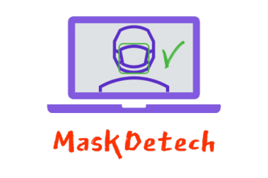
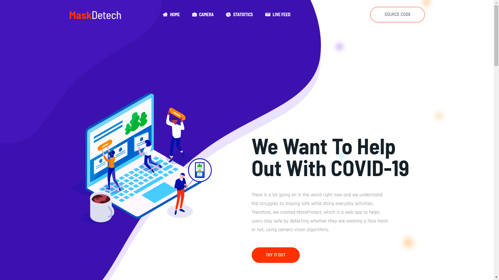
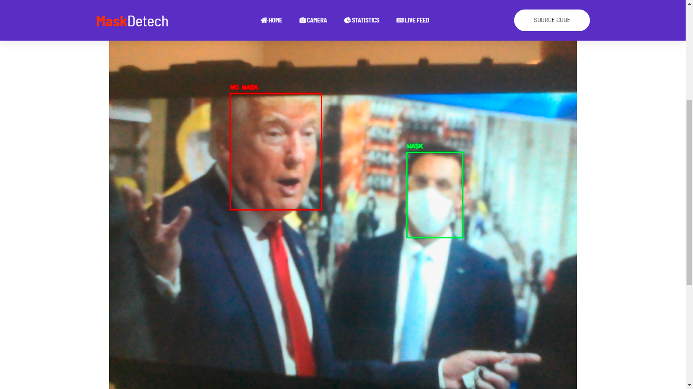
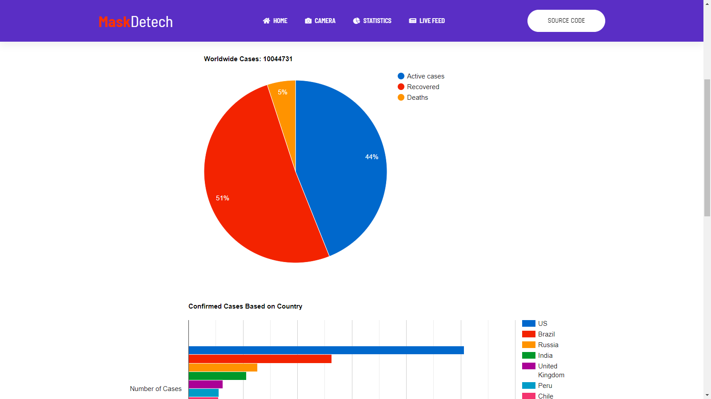
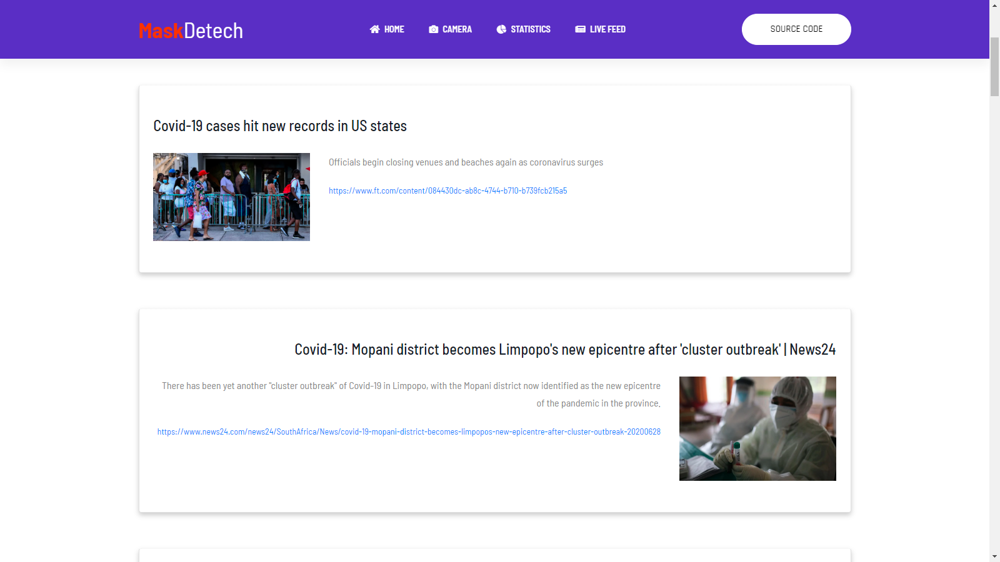

<p align="center">

 </p>

<h1 align="center">MaskDetech</h1> 

<p align="center">
This project was done for the HackMann 2020 Hacks Hackathon. We decided to create a web application that helps with the COVID-19 Pandemic by detecting if somebody is wearing a proper face mask or not. Our flask application has a live camera feature with OpenCV which detects a mask live. We also have a live news feed page all related to COVID-19, as well as a dedicated page for COVID-19 statistics.  
</p>

<p align="center">
A link to our devpost submission can be found here: <a href="https://devpost.com/software/maskdetech" target="_blank">devpost.com/software/maskdetech</a>
</p>

<p align="center">
A link to our YouTube demo video can be found here: <a href="https://youtu.be/WavRO4YaAJ8" target="_blank">youtu.be/WavRO4YaAJ8</a>
</p>

## Screenshots 

This is a sneak peek at our landing page. We describe our mission, function, and how the entire software package works. 



This is where users are able to use our live camera feature for live mask detection.



This is where users are able to see live COVID-19 statistics with the API and Google Charts.



This is where users are able to see a recurring news feed of COVID-19 related articles.



## Features
 
* Finding objects in pictures using YOLO
* Reading and parsing images with OpenCV
* Detecting if users are wearing proper face masks or not
* Real time statistics in interactive graphs and charts
* Recurring news feed of new articles related to the pandemic

## How We Built It

To analyse the images, we used YOLO, for finding the objects in the picture, OpenCV for reading and parsing the images, and TensorFlow / Keras for detecting masks in these images. For the COVID-19 graphs we used the Covid API with Google Charts. For the news feed page we used a News API to scrape 20 articles filtered by COVID-19. 

In addition, we created an accompanying web application using Flask, HTML, CSS, and JS, TensorFlow, Keras, Pandas, NumPy, OpenCV, Google Cloud Platform, and App Engine.

## Built With

* [Python](https://www.python.org/)
   * [Flask](https://flask.palletsprojects.com/)
   * [NumPy](https://numpy.org/)
   * [Pandas](https://pandas.pydata.org/)
   * [Requests](https://requests.readthedocs.io/en/master/)
   * [TensorFlow](https://www.tensorflow.org/)
   * [Keras](https://keras.io/)
   * [SciPy](https://www.scipy.org/)
   * [OpenCV](https://opencv.org/)
   * [Urllib3](https://urllib3.readthedocs.io/en/latest/)
   * [YOLO](https://www.pyimagesearch.com/2018/11/12/yolo-object-detection-with-opencv/)
   * [COVID API](https://pypi.org/project/COVID19Py/)
   * [News API](https://newsapi.org/docs/client-libraries/python)
* [Google Charts](https://developers.google.com/chart)
* [Google Cloud Platform App Engine](https://cloud.google.com/appengine/docs/python)
* [CSS3](https://developer.mozilla.org/en-US/docs/Archive/CSS3#:~:text=CSS3%20is%20the%20latest%20evolution,flexible%20box%20or%20grid%20layouts.)
* [JavaScript](https://www.javascript.com/)
* [HTML5](https://developer.mozilla.org/en-US/docs/Web/Guide/HTML/HTML5)

## Setup

#### Clone

```
git clone https://github.com/aahmad4/MaskDetech
```

#### Installation

Use the package manager [pip](https://pip.pypa.io/en/stable/) to install the required packages.

```
pip install -r requirements.txt
```

#### Usage
```
cd MaskDetech
```
```
export FLASK_APP=main.py
flask run
```
Then go to 
```
http://127.0.0.1:8080/
```

## Contributing

Pull requests are welcome. For major changes, please open an issue first to discuss what you would like to change.

Please make sure to update tests as appropriate.
